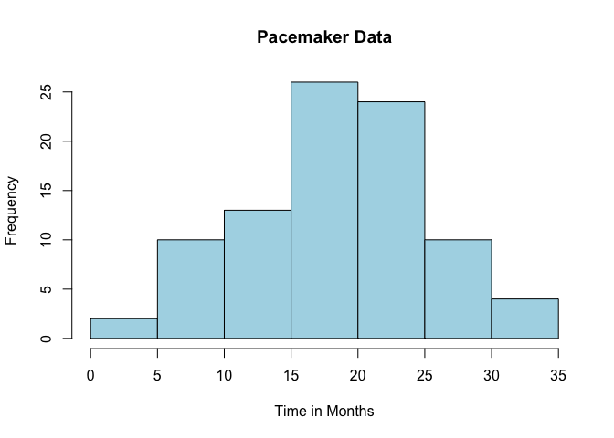
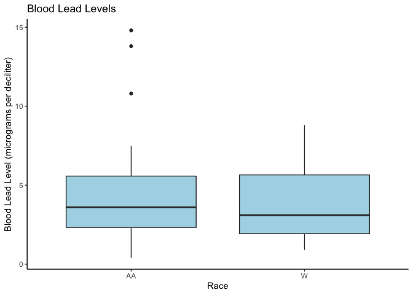

Setup
=====

    library(tidyverse)

    ## ── Attaching packages ────────────────────────────────────────────── tidyverse 1.3.0 ──

    ## ✓ ggplot2 3.3.2     ✓ purrr   0.3.4
    ## ✓ tibble  3.0.3     ✓ dplyr   1.0.2
    ## ✓ tidyr   1.1.2     ✓ stringr 1.4.0
    ## ✓ readr   1.3.1     ✓ forcats 0.5.0

    ## ── Conflicts ───────────────────────────────────────────────── tidyverse_conflicts() ──
    ## x dplyr::filter() masks stats::filter()
    ## x dplyr::lag()    masks stats::lag()

    library(ggplot2)

Problem 1
=========

Read in data and perform calculations
-------------------------------------

    problem1_df = 
      tibble(
        women_sample = c(1:11),
        fe_level = c(15.2, 9.3, 7.6, 11.9, 10.4, 9.7, 20.4, 9.4, 11.5, 9.4, 8.3)
        )
    fivenum(c(15.2, 9.3, 7.6, 11.9, 10.4, 9.7, 20.4, 9.4, 11.5, 9.4, 8.3))

    ## [1]  7.60  9.35  9.70 11.70 20.40

    mean(c(15.2, 9.3, 7.6, 11.9, 10.4, 9.7, 20.4, 9.4, 11.5, 9.4, 8.3))

    ## [1] 11.19091

    var(problem1_df$fe_level)

    ## [1] 13.55691

    sd(problem1_df$fe_level)

    ## [1] 3.681971

Problem 2
=========

Work shown in Word document
---------------------------

Problem 3
=========

Work shown in Word document
---------------------------

Importing Data
--------------

    problem3_df = read_table("./data/Pacemaker.txt")

    ## Parsed with column specification:
    ## cols(
    ##   Time = col_double()
    ## )

Create a histogram
------------------

    hist(problem3_df$Time, col = "lightblue", main = "Pacemaker Data", xlab = "Time in Months")

Calculate the mean, median, variance and standard deviation.
------------------------------------------------------------

    mean(problem3_df$Time)

    ## [1] 18.94382

    median(problem3_df$Time)

    ## [1] 20

    var(problem3_df$Time)

    ## [1] 49.64454

    sd(problem3_df$Time)

    ## [1] 7.045888

Calculate range
---------------

    range(problem3_df$Time)

    ## [1]  2 34

Problem 4
=========

Read in data and Create a boxplot
---------------------------------

    problem4_df = read_table2("./data/BloodPressure.txt")

    ## Warning: Missing column names filled in: 'X3' [3]

    ## Parsed with column specification:
    ## cols(
    ##   Race = col_character(),
    ##   BP = col_double(),
    ##   X3 = col_character()
    ## )

    ## Warning: 40 parsing failures.
    ## row col  expected    actual                       file
    ##   1  -- 3 columns 2 columns './data/BloodPressure.txt'
    ##   2  -- 3 columns 2 columns './data/BloodPressure.txt'
    ##   3  -- 3 columns 2 columns './data/BloodPressure.txt'
    ##   4  -- 3 columns 2 columns './data/BloodPressure.txt'
    ##   5  -- 3 columns 2 columns './data/BloodPressure.txt'
    ## ... ... ......... ......... ..........................
    ## See problems(...) for more details.

    ggplot(problem4_df, aes(x= Race, y= BP, fill = Race)) + 
      geom_boxplot(fill="lightblue")+
      labs(title="Blood Lead Levels", x="Race", y = "Blood Lead Level (micrograms per deciliter)")+
      theme_classic()

Problem 5
=========

Create a random distribution of 20 test scores with mean = 250, sd = 50.
------------------------------------------------------------------------

    set.seed(124)
    problem5_df = 
      tibble(
        student = 1:20,
        testscore = rnorm(20, 250, 50)
      )
    mean1 = mean(problem5_df$testscore)
    mean1

    ## [1] 250.5601

    var1 = var(problem5_df$testscore)
    var1

    ## [1] 2049.479

Now increase the test scores by 25% and calculate the new variance.
-------------------------------------------------------------------

    problem5_df_2 = problem5_df$testscore*1.25
    mean2 = mean(problem5_df_2)
    mean2

    ## [1] 313.2002

    var2 = var(problem5_df_2)
    var2

    ## [1] 3202.311

Calculations, ?change in mean and variance.
-------------------------------------------

    change_in_mean = mean2 / mean1
    change_in_mean

    ## [1] 1.25

    change_in_var = var2 / var1
    change_in_var

    ## [1] 1.5625

Problem 7
=========

    problem7_df = c(60, 30, 5, 1, 78, 16, 3, 2, 86, 10, 2, 1)
    p7_total = sum(problem7_df)
    (78+16+3+2) / p7_total *100

    ## [1] 33.67347

    (60 + 78 + 86) / 294

    ## [1] 0.7619048

    (60+ 30+ 5+ 1) / 294

    ## [1] 0.3265306

Binomial distributions
======================

Tutorial
--------

To obtain a binomial probability for a single X value: dbinom(x, n, p)
So for Example 1, we have: dbinom(0, 5, 0.15)

To obtain a probability for values less than or equal to X: pbinom(x, n,
p) So for Example 2, we have: pbinom(2, 5, 0.15)

Problem 9
=========
